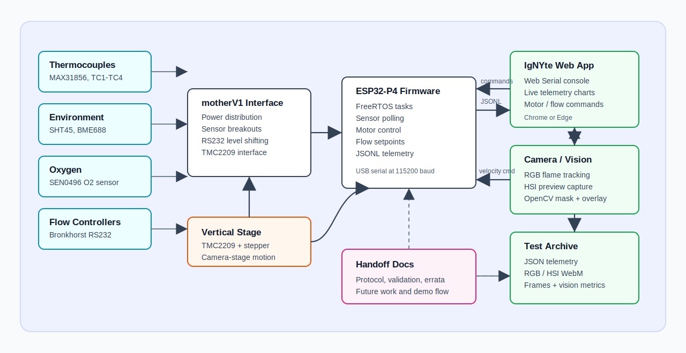
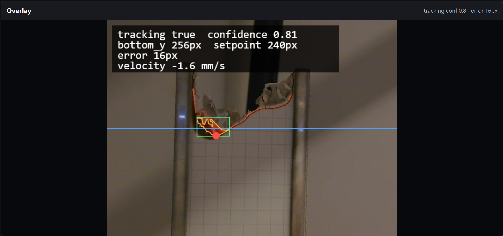

<!--
Primary author: Will Andre Pasimio Llaneta (wpl5304)
GitHub: https://github.com/andre-llaneta
Project: IgNYte-FPA
Context: NYU Tandon IgNYte Lab fire propagation apparatus internship work.
-->

# IgNYte-FPA

IgNYte-FPA contains the firmware, hardware files, validation notes, and prototype companion software for the NYU Tandon IgNYte Lab fire propagation apparatus sensor hub.

Primary author: Will Andre Pasimio Llaneta [andre-llaneta](https://github.com/andre-llaneta)

This repository focuses on the apparatus-side system: sensor acquisition, motorized vertical camera-stage control, serial command/telemetry output, hardware bring-up notes, and camera-tracking prototypes. The production IgNYte web application lives in a separate repository:

- IgNYte web app: [ikasturirangan/ignyte](https://github.com/ikasturirangan/ignyte)

## What This Repo Contains

```text
IgNYte-FPA/
  firmware/
    p4-sensor-hub-arduino/        Active ESP32-P4 PlatformIO firmware
      README.md                   Firmware architecture, task model, and build notes
    p4-sensor-hub/                Older ESP-IDF skeleton kept for reference
  hardware/
    motherV1/                     KiCad board files and JLCPCB manufacturing exports
    README.md                     Board overview and validation summary
    errata.md                     Known board issues and next-revision notes
  software/
    camera/                       OpenCV.js flame-tracking prototype
  tools/
    tmc_stall_sweep.py            Motor/StallGuard tuning helper script
  docs/
    firmware-serial-protocol.md   JSONL command, telemetry, and quick-reference protocol
    final-validation.md           Final validation checklist and observed results
    futurework.md                 Remaining integration work and handoff decisions
    change-log.md                 Confirmed fixes and design changes
  .github/workflows/
    firmware-opencv.yml           Firmware and OpenCV prototype CI checks
```

## System Scope

The active firmware targets a DFRobot FireBeetle 2 ESP32-P4 mounted on the `motherV1` interface board. The firmware currently supports:

- Thermocouple telemetry through MAX31856 devices
- SHT45 humidity/temperature telemetry
- BME688 environmental telemetry
- SEN0496 oxygen sensor telemetry
- I2C scanning and sensor status reporting
- TMC2209-controlled vertical camera-stage motion
- Hardware-timed STEP generation for smoother motor velocity control
- Axis calibration and software motion limits
- Flow-controller command placeholders / integration path
- Newline-delimited JSON command and telemetry over USB serial

The OpenCV.js work in this repo is a standalone prototype used to validate flame segmentation and tracking behavior before or alongside integration into the IgNYte web app.

## System Block Diagram

The apparatus is split into three main layers:

- physical sensors, flow controllers, motor hardware, and the `motherV1` interface board
- ESP32-P4 firmware that owns sensor polling, motor control, flow commands, and JSONL telemetry
- host-side tools, including the IgNYte web app, camera/vision tracking, recording, exports, and handoff documentation



The
firmware and hardware folders document the apparatus-side implementation, while
the production web app consumes the firmware JSON protocol over Web Serial and
records telemetry, camera streams, frame exports, and vision metrics for later
analysis.

## Firmware

Active firmware path:

```text
firmware/p4-sensor-hub-arduino/
```

Build the default ESP32-P4 firmware:

```powershell
pio run -d firmware/p4-sensor-hub-arduino
```

Run the native command-parser unit tests:

```powershell
pio test -d firmware/p4-sensor-hub-arduino -e native
```

Build the motor-only debug firmware:

```powershell
pio run -d firmware/p4-sensor-hub-arduino -e esp32-p4-motor-debug
```

The motor-only debug build defines `IGNYTE_MOTOR_ONLY_DEBUG=1`, which keeps the command and motor tasks active while skipping the sensor and flow-controller tasks.

## Serial Protocol

Firmware commands and telemetry use newline-delimited JSON over USB serial at `115200` baud.

Start here for command examples, response formats, telemetry messages, and host-parser expectations:

- [docs/firmware-serial-protocol.md](docs/firmware-serial-protocol.md)

Example command:

```json
{"cmd":"motor.status"}
```

Example telemetry/status line:

```json
{"type":"status","t_us":1007909,"component":"boot","status":"starting"}
```

## Hardware

The current board revision is `motherV1`, a fabricated and tested breakout/interface DAQ board for:

- FireBeetle 2 ESP32-P4
- TMC2209 motor driver
- MAX31856 thermocouple interfaces
- I2C sensors
- Analog sensors
- SPI sensors
- RS232 flow-controller interfaces
- MCP23017 I/O expansion
- Power distribution and buck converters

Start here:

- [hardware/README.md](hardware/README.md)
- [hardware/errata.md](hardware/errata.md)

Important bring-up note: keep motor and motor-driver power available during firmware boot when validating motor configuration. If the TMC2209 is unpowered during initialization, configuration writes such as microstep setup may be missed.

## Operator Bring-Up Flow

Use this order when bringing up the full apparatus from a cold start:

1. Power the `motherV1` board and the motor-driver/motor supply before firmware boot when validating motor behavior.
2. Open the IgNYte web app or the standalone OpenCV.js prototype.
3. Connect to the ESP32-P4 over Web Serial / USB serial.
4. Confirm boot JSON reaches the host and ends in `boot ready` or documented `boot ready_with_warnings`.
5. Run `motor.driver_status` and confirm `connection_ok:true` and the expected microstep readback.
6. Run `sensor.status` and confirm required sensors are online.
7. Enable the motor with `motor.enable`.
8. Run `motor.calibrate_axis` before any normal target, velocity, or closed-loop tracking motion.
9. Confirm `motor.status` reports `limits_valid:true`.
10. Test one small manual move or one `Send Current Recommendation Once` command before enabling auto control.
11. Start camera tracking and verify the mask, contour, bottom point, and command sign are correct.
12. Enable auto control only after the stage is clear, calibrated, and moving in the expected direction.

For the full demo checklist, use [docs/operator-demo-flow.md](docs/operator-demo-flow.md).

## Production Web App

The production IgNYte web app lives in the separate
[ikasturirangan/ignyte](https://github.com/ikasturirangan/ignyte) repository.
This repo owns the apparatus firmware, hardware files, serial protocol, and
OpenCV prototype; the web app owns the production UI, dashboard workflow, local
data model, and export behavior.

The web app expects the firmware protocol documented in
[docs/firmware-serial-protocol.md](docs/firmware-serial-protocol.md):
newline-delimited JSON over USB serial at `115200` baud. Browser-side board
control uses Web Serial, so operators should use Chrome or Edge over
`localhost` or HTTPS.

During a test, the web app exposes board connect/reset, live telemetry, serial
console, motor controls, flow setpoints, sensor status/configuration commands,
safety-gated start/stop, RGB camera recording/OpenCV tracking, HSI preview
recording, and frame export FPS selection.

At the end of a run, the app saves a zip archive named:

```text
YYYYMMDD-HHMMSS-PSETID.zip
```

Expected contents:

```text
YYYYMMDD-HHMMSS-PSETID.json
YYYYMMDD-HHMMSS-PSETID-rgb.webm
YYYYMMDD-HHMMSS-PSETID-hsi.webm
frames/
  YYYYMMDD-HHMMSS-Frame000001.jpg
  YYYYMMDD-HHMMSS-Frame000002.jpg
vision/
  flame-tracking-overlay.webm
  tracking-metrics.json
```

The JSON stores run metadata, the frame list, and all sensor samples. Each
sample gets an `elapsedMs` timestamp from test start and an `associatedFrame`
pointing to the nearest exported frame, including the frame number, filename,
frame time, and time delta. This gives post-processing a direct telemetry to
image alignment.

Vision tracking metrics are saved in a separate `vision/` folder for analysis of
the flame-tracking algorithm and motor-control behavior. The metrics log records
the tracker state over time, including frame ID, elapsed time, tracking status,
confidence, setpoint position, detected flame-bottom position, vertical error,
recommended motor velocity, and processed FPS. The archive also includes a 
flame-tracking overlay video.

Current HSI support is browser-preview video/JPEG only. It is not native RAW
hyperspectral datacube capture. A real Telops-style `.raw/.hdr`,
`radiance.sc/.hdr`, or `.hcc` workflow should be handled by a native camera
agent or vendor software, with those native files referenced from the web app's
archive manifest.

## Camera / OpenCV Prototype

The standalone OpenCV.js prototype lives at:

```text
software/camera/opencv-js-prototype/
```

It is used to test flame segmentation, bottom-of-flame tracking, P/PI/feed-forward control behavior, and serial motor command generation before relying on the production web app.

Current flame setup values that worked well in testing:

```js
brightHsvLow: { h: 0, s: 0, v: 133 }
brightHsvHigh: { h: 13, s: 255, v: 255 }
coloredHsvLow: { h: 0, s: 196, v: 19 }
coloredHsvHigh: { h: 8, s: 255, v: 255 }
minAreaPx: 50
kernelSizePx: 2
exposureTime: 35
```

Current overlay:



Current binary mask:


Start here:

- [software/camera/README.md](software/camera/README.md)
- [software/camera/opencv-js-prototype/README.md](software/camera/opencv-js-prototype/README.md)

## CI

GitHub Actions workflow:

```text
.github/workflows/firmware-opencv.yml
```

Current CI checks:

- PlatformIO ESP32-P4 firmware build
- Native command-parser unit tests
- JavaScript syntax checks for the OpenCV.js prototype

## Documentation

Documentation starts at:

- [docs/README.md](docs/README.md)

Most useful documents:

- [firmware/p4-sensor-hub-arduino/README.md](firmware/p4-sensor-hub-arduino/README.md): firmware architecture, task model, pin summary, and motor/sensor design
- [docs/firmware-serial-protocol.md](docs/firmware-serial-protocol.md): JSON command and telemetry protocol
- [docs/final-validation.md](docs/final-validation.md): final validation checklist and observed validation results
- [docs/futurework.md](docs/futurework.md): remaining integration work and major handoff decisions
- [docs/change-log.md](docs/change-log.md): confirmed changes and debugging history

## Current Project Status

At the time of this README update:

- Sensor telemetry has been validated for the main environmental and thermocouple sensors.
- Motor command/control paths are active and guarded by calibrated software limits.
- Hardware-timed step generation has been added to reduce software step-generation bottlenecks.
- The OpenCV.js flame tracker has been prototyped with dual flame masks and serial command output.
- The IgNYte web app is expected to handle the production operator UI in the separate web app repository.
- Final apparatus-level closed-loop tracking validation remains future work because the complete mechanical chamber/stage assembly was not available within the internship window.
- Flow-controller testing remains dependent on flow-controller hardware availability.
