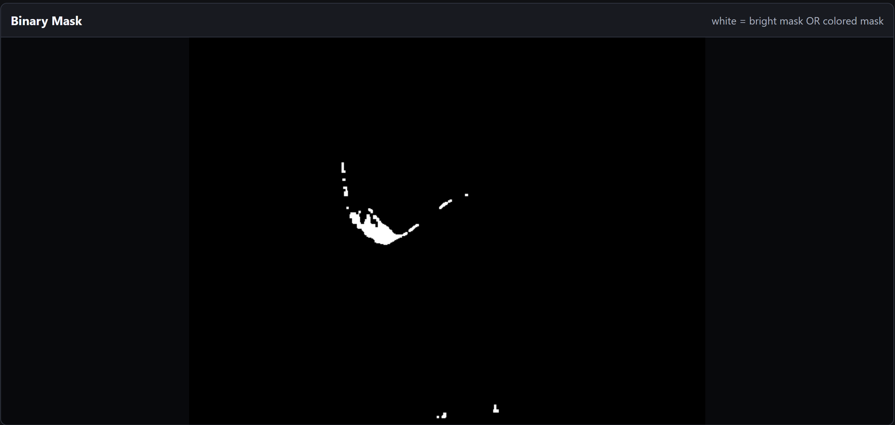

<!--
Primary author: Will Andre Pasimio Llaneta (wpl5304)
GitHub: https://github.com/andre-llaneta
Project: IgNYte-FPA
Context: NYU Tandon IgNYte Lab fire propagation apparatus internship work.
-->

# Operator Demo Flow

This is the clean-boot bring-up flow for demonstrating or handing off the IgNYte-FPA firmware, sensor telemetry, motor stage, and flame-tracking UI.

Use this as an operator checklist. Use `docs/final-validation.md` to record the actual results from a completed run.

## Preconditions

- The stage is clear of hands, cables, and tools.
- The motor supply and motor driver are powered before the ESP32-P4 firmware boots.
- The ESP32-P4 is connected to the host computer over USB.
- Chrome or Edge is available for Web Serial and camera access.
- The IgNYte web app is open, or the standalone OpenCV.js prototype is open from `localhost`.
- The RGB webcam used for flame tracking is connected and selectable in the camera UI.
- Auto control is off.

Important: if the TMC2209 is unpowered during firmware boot, driver configuration writes can be missed. Calibration reconfigures the driver again, but motor power should still be on before boot for the cleanest demo.

## Hardware Safety Checks

Before applying power, verify every socketed module and breakout board is seated in the correct header, correct orientation, and correct pin alignment. The current board uses female headers for several modules, which makes it possible to insert a module into the wrong header position or offset it by one pin without noticing.

A one-pin offset can connect supply voltage to the wrong module pin and permanently damage hardware. For the TMC2209 specifically, check VIN, GND, VM, EN, STEP, DIR, and UART pin alignment against the board silkscreen before powering the stage.

## Clean Boot

1. Power the `motherV1` board and motor-driver/motor supply.
2. Connect the ESP32-P4 USB cable.
3. Open the web app or serial monitor.
4. Connect to the firmware serial port.
5. Wait for boot output.

Expected final boot status:

```json
{"type":"status","component":"boot","status":"ready"}
```

Acceptable with known noncritical warnings:

```json
{"type":"status","component":"boot","status":"ready_with_warnings"}
```

Do not continue if the board repeatedly resets, stops before a final boot status, or produces malformed JSON after boot.

## Sensor Check

1. Send:

```json
{"cmd":"sensor.status"}
```

2. Confirm required sensors are online in the web app telemetry.
3. Confirm BME688, SHT45, thermocouples, and oxygen telemetry update at the expected rates.

Expected behavior:

- Sensor telemetry appears as newline-delimited JSON.
- The web app displays sensor values without dropping the serial connection.
- Thermocouples remain mapped in the documented order.
- If all I2C devices fail together, suspect an I2C bus-level issue first, such as a disconnected device, bad cable, or device pulling SDA/SCL away from their normal idle level.

## Motor Driver Check

1. Send:

```json
{"cmd":"motor.driver_status"}
```

2. Confirm:

- `connection_ok:true`
- microstep readback matches the configured firmware value
- driver status fields are present

Do not continue if `connection_ok:false`, the driver is not responding, or the microstep value is not what the firmware expects.

## Motor Calibration

1. Enable the motor:

```json
{"cmd":"motor.enable"}
```

2. Start axis calibration:

```json
{"cmd":"motor.calibrate_axis"}
```

3. Wait for calibration to complete.
4. Send:

```json
{"cmd":"motor.status"}
```

5. Confirm:

- `enabled:true`
- `calibration_active:false`
- `limits_valid:true`
- min and max limits are plausible for the physical stage

Normal target, velocity, and closed-loop tracking motion should not be used until `limits_valid:true`.

## Camera / OpenCV Check

1. Start the camera stream.
2. Select the RGB tracking webcam.
3. Set or confirm the tuned flame segmentation values:

```js
brightHsvLow: { h: 0, s: 0, v: 133 }
brightHsvHigh: { h: 13, s: 255, v: 255 }
coloredHsvLow: { h: 0, s: 196, v: 19 }
coloredHsvHigh: { h: 8, s: 255, v: 255 }
minAreaPx: 50
kernelSizePx: 2
exposureTime: 35
```

4. Confirm the overlay and mask match the reference images:




Expected behavior:

- The binary mask isolates the flame region.
- The contour follows the intended flame body.
- The bottom point tracks the bottom of the flame.
- Tracking becomes false or low-confidence when the flame leaves the frame.

## One-Shot Motion Test

Before enabling auto control:

1. Confirm `limits_valid:true`.
2. Confirm the stage is clear.
3. Confirm the camera setpoint line and bottom point are visible.
4. Use one manual move or `Send Current Recommendation Once`.
5. Verify that the stage moves in the expected direction.
6. If the direction is wrong, stop immediately and fix `controlSign` before continuing.

Expected behavior:

- The serial log shows a `motor.velocity_mm_s` command.
- The stage moves smoothly.
- The stage remains inside calibrated limits.
- The firmware velocity watchdog stops motion if commands stop.

## Auto Control Demo

Only enable auto control after the one-shot test passes.

1. Confirm auto control is off.
2. Confirm the motor is enabled and calibrated.
3. Confirm tracking is stable and confidence is acceptable.
4. Enable auto control.
5. Watch the stage follow the flame.
6. Keep a hand near the software stop / disable control.

Expected behavior:

- Auto control sends rate-limited `motor.velocity_mm_s` commands.
- Lost tracking commands zero velocity.
- The stage follows the flame without hitting software limits.
- The operator can turn auto control off and stop the motor.

## Stop / Shutdown

1. Turn auto control off.
2. Send:

```json
{"cmd":"motor.stop"}
```

3. Disable the motor if the demo is complete:

```json
{"cmd":"motor.disable"}
```

4. Save or export telemetry, camera, and validation notes if needed.
5. Power down the motor supply after motion has stopped.

## Fail Conditions

Stop the demo and debug before continuing if any of these occur:

- Boot does not reach `ready` or `ready_with_warnings`.
- The serial connection drops repeatedly.
- `motor.driver_status` reports `connection_ok:false`.
- Calibration does not complete.
- `motor.status` does not report `limits_valid:true` after calibration.
- Multiple I2C sensors disappear at the same time.
- Any socketed module appears misaligned, loose, hot, damaged, offset on its headers, or seated in the wrong header position.
- The stage moves opposite the expected direction.
- The stage skips, binds, stalls, or repeatedly gets stuck at the same physical spot.
- The OpenCV mask locks onto reflections instead of the flame.
- Auto control sends commands while tracking is lost.
