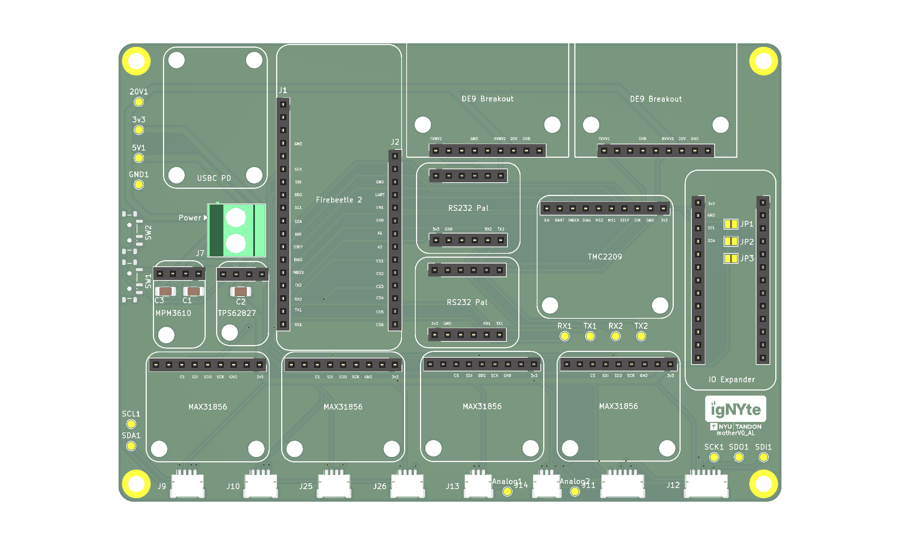

<!--
Primary author: Will Andre Pasimio Llaneta (wpl5304)
GitHub: https://github.com/andre-llaneta
Project: IgNYte-FPA
Context: NYU Tandon IgNYte Lab fire propagation apparatus internship work.
-->

# motherV1



`motherV1` is a fabricated and tested custom DAQ/interface motherboard for the IgNYte-FPA ESP32-P4 sensor hub. It consolidates the apparatus support electronics onto one PCB, mounting the FireBeetle 2 ESP32-P4, sensor breakout interfaces, TMC2209 stepper-driver interface, RS232 flow-controller interfaces, and 20 V / 5 V / 3.3 V power distribution used for fire-propagation apparatus bring-up and firmware integration.

The board is intended to reduce loose wiring during apparatus bring-up by collecting the major support electronics on one PCB:

- DFRobot FireBeetle 2 ESP32-P4 controller interface
- Adafruit TMC2209 stepper motor driver interface
- Adafruit MCP23017 I/O expander
- 4 Adafruit MAX31856 thermocouple interfaces
- Adafruit SHT45, Adafruit BME688, and DFRobot SEN0496 I2C sensor interfaces
- SPI and analog sensor expansion
- Omron D6F analog flow sensor support
- Adafruit RS232 Pal interfaces for flow-controller UART level shifting
- Motor DIAG, INDEX, and endstop-related signals
- USB-C power input
- MPM3610 buck converter
- TPS62827 buck converter
- Power distribution for the sensor hub peripherals

## External Boards And Modules

The current board was designed around these external boards/modules and sensor breakouts. Verify exact part numbers against the BOM and physical hardware before ordering replacements.

| Function | Part / module | Link |
| --- | --- | --- |
| Main MCU | DFRobot FireBeetle 2 ESP32-P4 AI Vision Board | [DFRobot product page](https://www.dfrobot.com/product-2915.html) / [DFRobot wiki](https://wiki.dfrobot.com/dfr1172/) |
| Stepper driver | Adafruit TMC2209 Stepper Motor Driver Breakout Board | [Adafruit product 6121](https://www.adafruit.com/product/6121) |
| Thermocouple interface | Adafruit Universal Thermocouple Amplifier MAX31856 Breakout | [Adafruit product 3263](https://www.adafruit.com/product/3263) |
| Temperature/RH | Adafruit Sensirion SHT45 Precision Temperature & Humidity Sensor | [Adafruit product 5665](https://www.adafruit.com/product/5665) |
| Environment / gas | Adafruit BME688 Temperature, Humidity, Pressure and Gas Sensor | [Adafruit product 5046](https://www.adafruit.com/product/5046) |
| Oxygen | DFRobot Gravity SEN0496 Electrochemical Oxygen / O2 Sensor | [DFRobot product page](https://www.dfrobot.com/product-2569.html) / [DFRobot wiki](https://wiki.dfrobot.com/sen0496/) |
| I/O expansion | Adafruit MCP23017 I2C GPIO Expander Breakout | [Adafruit product 5346](https://www.adafruit.com/product/5346) |
| RS232 level shifting | Adafruit RS232 Pal MAX3232E | [Adafruit product 5987](https://www.adafruit.com/product/5987) |
| 5 V buck converter | Adafruit MPM3610 5V Buck Converter Breakout | [Adafruit product 4739](https://www.adafruit.com/product/4739) |
| 3.3 V buck converter IC | Texas Instruments TPS62827 | [TI product page](https://www.ti.com/product/TPS62827) |
| Analog flow velocity sensor | Omron D6F series / D6F-V03A1 | [Omron D6F series](https://components.omron.com/us-en/products/sensors/D6F) |

## Directory Layout

```text
hardware/
  README.md
  errata.md
  motherV1/
    motherV1.kicad_pro
    motherV1.kicad_sch
    motherV1.kicad_pcb
    motherv1-schematic.pdf
    jlcpcb/
      motherV1.zip
      bom.csv
      positions.csv
      designators.csv
      netlist.ipc
```

## Design Files

The KiCad source files for the board are stored in `hardware/motherV1/`.

- `motherV1.kicad_pro`: KiCad project file
- `motherV1.kicad_sch`: schematic source
- `motherV1.kicad_pcb`: PCB layout source
- `motherv1-schematic.pdf`: exported schematic PDF for quick review

The `hardware/motherV1/jlcpcb/` directory contains manufacturing/export files for JLCPCB, including the Gerber archive, BOM, component placement data, designators, and IPC netlist.

## Board Status

`motherV1` has been fabricated and tested. The board is usable for current bring-up and firmware integration work, but it has known revision notes that should be addressed before a future hardware revision.

See [errata.md](./errata.md) for confirmed hardware issues and next-revision recommendations.

## Validation Summary

| Subsystem | Status | Evidence |
| --- | --- | --- |
| 20 V input | Validated | Measured voltage/current |
| 5 V buck | Validated | No-load/load voltage |
| 3.3 V buck | Validated | No-load/load voltage |
| FireBeetle headers | Usable with errata | Footprint offset noted |
| I2C sensors | Validated | Scan + telemetry |
| Thermocouples | Validated | MAX31856 telemetry |
| TMC2209 | Validated with bodge | UART/status/motion |
| Endstop | Works, needs connector | Errata |
| Flow RS232 | Pending controllers | Planned test |

## Thermocouple Channel Mapping

The current firmware labels the four installed MAX31856 thermocouple channels by their chip-select GPIOs. The confirmed physical thermocouple order is:

| Physical thermocouple order | Firmware sensor name | GPIO / CS |
| ---: | --- | ---: |
| 1 | `tc1` | 21 |
| 2 | `tc2` | 36 |
| 3 | `tc3` | 35 |
| 4 | `tc4` | 20 |

The remaining SPI chip-selects, GPIO `34` and GPIO `31`, are reserved for future offboard SPI devices.

## Known Errata Summary

The current hardware errata includes:

- Missing dedicated motor endstop connector
- TMC2209 UART RX path requiring a 1 kOhm series resistor / bodge routing
- Insufficient convenient ground access points for bring-up and probing
- FireBeetle 2 ESP32-P4 header footprint offset of approximately 1 mm

Refer to [errata.md](./errata.md) for the detailed impact and proposed fixes for each issue.

## Notes For Bring-Up

- Before applying power, verify every socketed module and breakout board is seated in the correct header, correct orientation, and correct pin alignment. The board uses female headers for several modules, so it is possible to insert a module into the wrong position or offset it by one pin without noticing. A one-pin offset can connect supply voltage to the wrong module pin and permanently damage hardware.
- Keep the motor driver and motor power available during firmware boot when testing motor configuration. If the driver is unpowered during initialization, configuration commands such as microstep setup may not take effect and the driver can remain at its default settings.
- Treat the JLCPCB export folder as a snapshot of the current fabricated revision. Regenerate manufacturing files from KiCad before ordering a revised board.
- Do not delete or ignore the errata when using this revision; several issues affect motor bring-up, wiring reliability, and next-board layout changes.
